# Trabajo Práctico 0 - Git

En este tp vamos a explorar brevemente el uso de **git**. 

**git** es una herramienta muy versátil y poderosa, que se puede adaptar a una gran cantidad de escenarios y flujos de trabajo.
Por esta razón, en una primera mirada nos puede parecer abrumador el número de comandos y variantes que brinda,
pero trataremos de restringirnos a los casos de uso más comunes y al _workflow_ que usaremos en la materia.

## Introducción

¿Qué es git? Citando a [su documentación](https://git-scm.com/):

> Git es un sistema de **control de versiones** gratuito y de código abierto, diseñado para manejar proyectos de cualquier tamaño de manera veloz y eficiente.

> ¿Qué es un control de versiones? Un control de versiones es un sistema que **registra los cambios realizados en un archivo o conjunto de archivos a lo largo del tiempo**, de modo que puedas recuperar versiones específicas más adelante.

> La principal diferencia entre Git y cualquier otro VCS es la forma en la que manejan sus datos. Conceptualmente, la mayoría de los otros sistemas almacenan la información como una lista de cambios en los archivos.
> Git maneja sus datos como un **conjunto de copias instantáneas en un filesystem mínimo**. Cada vez que confirmas un cambio, o guardas el estado de tu proyecto en Git, él básicamente toma una foto del aspecto de todos tus archivos en ese momento y guarda una referencia a esa copia instantánea. Para ser eficiente, si los archivos no se han modificado Git no almacena el archivo de nuevo, sino un enlace al archivo anterior idéntico que ya tiene almacenado. 

> **La mayoría de las operaciones en Git sólo necesitan archivos y recursos locales** para funcionar. Por ejemplo, (...) si quieres ver los cambios introducidos en un archivo entre la versión actual y la de hace un mes, Git puede buscar el archivo de hace un mes y hacer un cálculo de diferencias localmente, en lugar de tener que pedirle a un servidor remoto que lo haga, u obtener una versión antigua desde la red y hacerlo de manera local. 

> Esto significa que hay muy poco que no puedes hacer si estás desconectado o sin VPN. Si te subes a un avión o a un tren y quieres trabajar un poco, puedes confirmar tus cambios felizmente hasta que consigas una conexión de red para subirlos. 

Debido a su popularidad, se dispone de una cantidad enorme de tutoriales y guías de uso. Recomendamos algunas que nos parecieron interesantes en la sección [Referencias](#ref).

Supondremos a lo largo del taller una instalación de Linux, de tipo Ubuntu/Debian. Si instalaste alguna distribución basado en otro sistema (Arch, Fedora), entonces entendemos que _sabes de qué va la cosa_. Si sos usuario/a de Windows, existe una herramienta llamada WSL que nos permite contar con una instalación y consola de Linux que pueden utilizar para los trabajos de la materia, les dejamos un link con instrucciones básicas de instalación y uso: https://learn.microsoft.com/es-es/windows/wsl/install. Desde la materia les recomendamos fuertemente tomar la oportunidad para procurar una instalación de Linux; pueden acercarse durante los laboratorios si tienen algún problema creando el dual boot.

La estructura de este trabajo práctico es la siguiente:

- [Trabajo Práctico 0 - Git](#trabajo-práctico-0---git)
  - [Introducción](#introducción)
    - [Configurando acceso HTTPS](#configurando-acceso-https)
    - [Clonando el repositorio](#clonando-el-repositorio)
  - [Ejercicio 1: Crear una branch](#ejercicio-1-crear-una-branch)
    - [Branches (ramas)](#branches-ramas)
    - [Ejercicio](#ejercicio)
  - [Ejercicio 2: Modificar un archivo y crear un commit](#ejercicio-2-modificar-un-archivo-y-crear-un-commit)
  - [Ejercicio 3: crear un Pull Request con los cambios y mergear a main](#ejercicio-3-crear-un-pull-request-con-los-cambios-y-mergear-a-main)
    - [Pull requests](#pull-requests)
  - [Como hacer consultas de TP](#como-hacer-consultas-de-tp)
    - [Foro de consultas en discord](#foro-de-consultas-en-discord)
    - [Issue tracker en github](#issue-tracker-en-github)
  - [Gists](#gists)
  - [Ejercicio 4 (opcional): ejercitar issues y gists](#ejercicio-4-opcional-ejercitar-issues-y-gists)


<h2 id="installation">Instalación y configuración</h2>

Para instalar **git** en una distribución Debian/Ubuntu simplemente debemos hacer:

```shell
$ sudo apt install git
```

Podemos comprobar que ha sido instalado correctamente, haciendo

```shell
$ git --version
```

En cuanto a la configuración, debemos indicarle a git nuestro nombre y mail para que pueda firmar los commits
cada vez que hagamos uno.

```shell
$ git config --global user.name <su nombre>
$ git config --global user.email <su email>
```

Pasando el parámetro `--global` aplicamos la configuración para nuestro usuario, con lo cual quedará configurado con estos parámetros para todos los repos nuevos que creemos.

> [!WARNING]
> En las computadoras de los laboratorios, pueden correr estos comandos sin la opción --global cuando estén parados dentro del clon de su repo (más adelante) para que no quede configurado su nombre y mail para el resto de los estudiantes que usen la PC.

<h2 id="cloning">Clonando el repo</h2>

Con git instalado podemos clonar el repositorio del TP a su PC. De esta manera, podrán trabajar localmente sobre el repositorio local e ir sincronizando los cambios al repositorio remoto (en este caso alojado en **github.com**), a medida que lo crean necesario.

Hay tres formas de clonar un repositorio:

- Utilizando la url que comienza con *https://github.com/*
- Por SSH
- Por Github CLI

Si clonamos utilizando la primera opción, tendremos que autenticarnos con usuario y Personal Access Token (su configuración se explica en el próximo apartado) cada vez que hagamos alguna operación con el servidor remoto desde nuestra PC. Esta es la opción más segura en computadoras compartidas, pero se torna molesta rápidamente. Nuestras recomendaciones son las siguientes:

- **En su computadora personal**, configurar un acceso por _SSH_ que creemos es lo más sencillo y cómodo (existen otras opciones como configurar un administrador de credenciales). Para configurar una clave ssh pueden seguir los pasos que están en el siguiente [link](https://docs.github.com/en/authentication/connecting-to-github-with-ssh). Los pasos claves son "Generate an SSH key pair" y "Add an SSH key to your GitLab account". 
- **En las computadoras de los laboratorios**, donde varias personas utilizan el mismo usuario y posiblemente ustedes cambien de computadoras entre clases, recomendamos configurar acceso mediante HTTPS. Si realmente desean utilizar SSH es posible [configurar múltiples claves](https://stackoverflow.com/questions/2419566/best-way-to-use-multiple-ssh-private-keys-on-one-client/38454037#38454037) para el mismo sitio, pero tengan en cuenta que tendrán que hacerlo en cada computadora que quieran usar, y que **deben** asociar una contraseña a la clave para evitar que otros usuarios realicen operaciones en su nombre.

### Configurando acceso HTTPS

Para acceder mediante HTTPS a github es necesario crear un Personal Access Token (PAT), que funcionan como contraseñas temporales, con vencimiento y scope más reducido que una contraseña (podemos darle permiso solo de lectura al PAT, por ejemplo).

Para crearlo debemos ingresar a las preferencias de github e ir a la última opción del menú: [`Developer Settings` (Configuraciones de desarrollo)](https://github.com/settings/apps).

En la página de configuraciones de desarrollo, seleccionamos el menú de Personal access tokens, submenú `Tokens (classic)`.

Nos aparecerá un botón para generar un nuevo token, `Generate new token` que abrirá un desplegable. **Recomendamos elegir `Generate new token (classic)`** ya que es considerablemente más sencillo de configurar.

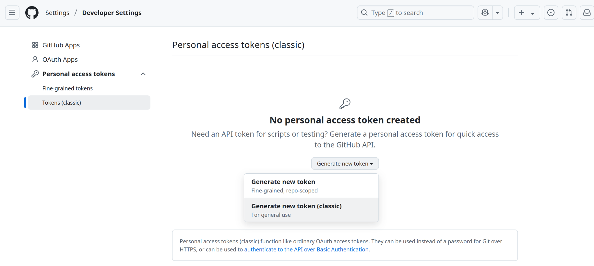

En la página resultante, basta con seleccionar el scope `repo`.
Pueden colocar la nota que deseen como "nombre" del PAT.
Para mayor seguridad, pueden dar una expiración de un día al PAT de manera que su vencimiento sea cercano al fin de la clase. De todos modos, github no debería estar guardando su PAT en la computadora en ningún momento. Además **pueden revocar los PAT generados en cualquier momento**. Si por algún motivo creen que su access token fue comprometido, podrán darlo de baja en esta misma página.

Terminadas las configuraciones, seleccionamos `Generate token` para generar el PAT.

> [!WARNING]
> **:warning: sólo se mostrará el PAT generado una vez**
> así que este es el momento de guardarlo en algún lugar accesible pero seguro.

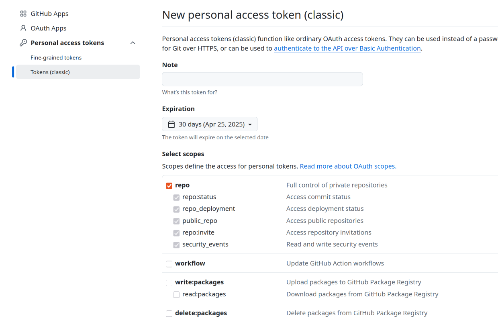

Creado el PAT, nos figurará en la página anterior

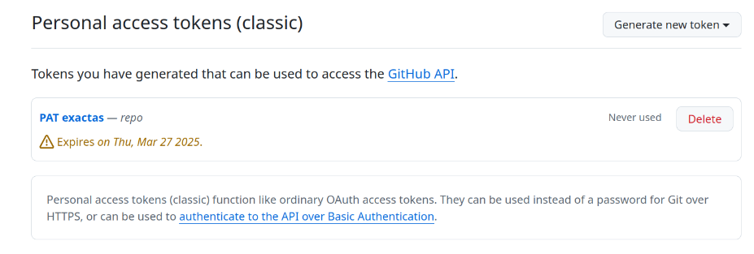

Y ahora podemos clonar el repositorio desde la línea de comandos.

### Clonando el repositorio

Una vez configurado nuestro PAT o clave ssh (se puede [probar la clave ssh](https://docs.github.com/en/authentication/connecting-to-github-with-ssh/testing-your-ssh-connection)!) vamos a usar la dirección del dropdown `clone` correspondiente al tipo de acceso que elegimos. Por ejemplo, si estamos usando SSH, usaremos la dirección que comienza con **git@github.com** para clonar el repositorio:

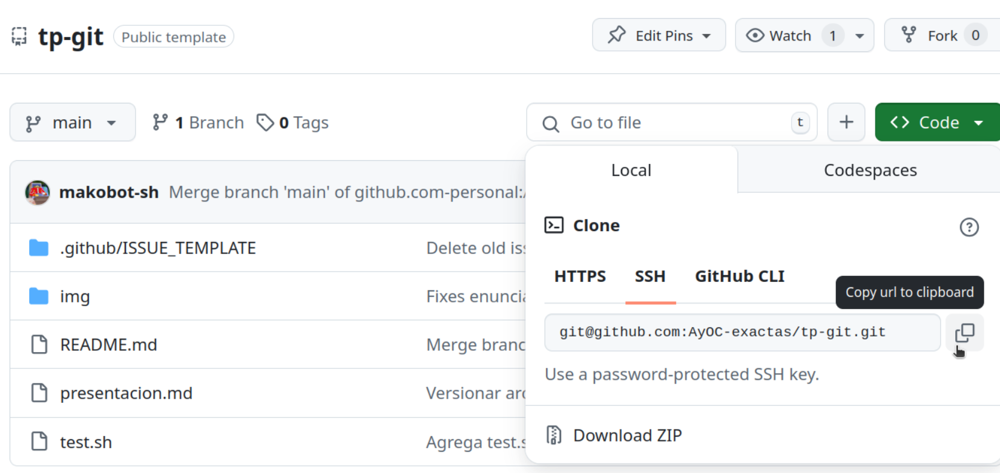

Si quisieramos clonar un repositorio con dirección SSH: **git@github.com:ejemplo/tp-git**: abrimos una terminal, hacemos `cd` al directorio en el cual querramos guardar la copia local del repositorio y ejecutamos

```shell
$ git clone git@github.com:ejemplo/tp-git
```

Al usar ssh, la autenticación es automática.

De elegir usar HTTPS, corremos el mismo comando reemplazando la dirección ssh por la dirección HTTPS del dropdown `clone` (en este caso sería `https://github.com/ejemplo/tp-git`).

En ese caso se nos solicitará ingresar el usuario (presionar enter) y contraseña (en este momento se puede pegar el PAT a la terminal presionando `ctrl + shift + v` - NO se imprimirá en pantalla la contraseña, hay que confiar y presionar enter e intentar de nuevo si no funcionó).

Si todo salió bien, deberíamos ver algo parecido a lo siguiente:

```shell
Cloning into 'tp-git'...
remote: Enumerating objects: 24, done.
remote: Counting objects: 100% (24/24), done.
remote: Compressing objects: 100% (19/19), done.
remote: Total 24 (delta 0), reused 24 (delta 0), pack-reused 0
Receiving objects: 100% (24/24), 303.16 KiB | 192.00 KiB/s, done.
```

y aparecerá un subdirectorio **tp-git**.

Les recomendamos usar el editor de texto VSCode [vscode](https://code.visualstudio.com/) en el que pueden descargar las siguientes dos extensiones que son utiles para manejar repositorios de git:

[gitlens](https://marketplace.visualstudio.com/items?itemName=eamodio.gitlens)
[git-graph](https://marketplace.visualstudio.com/items?itemName=mhutchie.git-graph)

Pueden instalarlas de dos maneras:

1. Desde el marketplace
2. Haciendo Ctrl + P (Quick Open) y luego:

```shell
ext install mhutchie.git-graph
ext install eamodio.gitlens
```

Para acceder al gráfico de git:

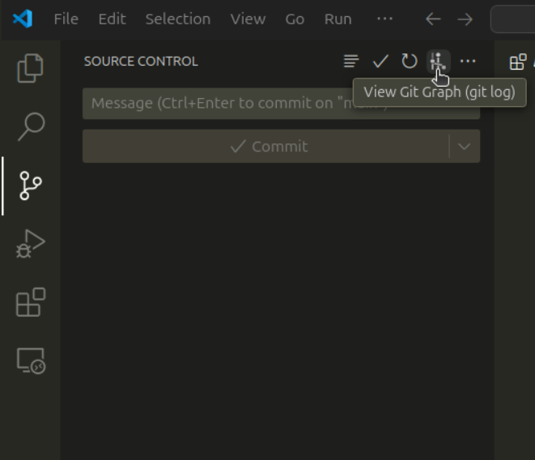


<h3 id="push">Aplicar cambios locales al repositorio remoto</h3>

Cualquier modificación que realicemos en el directorio solo afectará el estado del repositorio local (que se encuentra alojado en el directorio oculto **.git**). Cuando estemos listos para reflejar los cambios en el servidor remoto, realizaremos una serie de pasos:

- :pen_fountain: **Completen con sus datos el archivo datos_estudiante.txt** así tenemos una modificación para versionar.

En primer lugar debemos seleccionar los archivos modificados/agregados que pretendemos subir. Se pueden seleccionar todos clickeando en el botón que indica la imagen, o seleccionar manualmente cada uno utilizando los botones `+` individuales a la derecha de cada archivo. En su caso el único archivo a versionar será datos_estudiante.txt

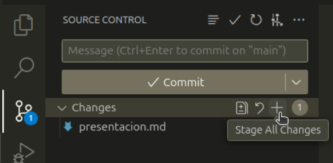

Luego debemos realizar un _commit_ de los cambios realizados desde la última versión guardada del repositorio (el _commit_ anterior). Todo _commit_ tiene asociado un _mensaje_ que describe brevemente las modificaciones que están siendo aplicadas. En este caso elegimos el mensaje `"datos completados"`.


Escrito el mensaje, podemos **apretar el símbolo de tilde** :white_check_mark: para grabar el _commit_.

Así nuestros cambios han sido registrados en un commit *local* pero aún no se han aplicado en el repositorio _remoto_. 
Se pueden realizar múltiples commits locales si se quieren ir estableciendo puntos en los que el desarrollo es estable antes de seguir avanzando (esto también facilita que los mensajes de commit sean descriptivos), de forma que si algún cambio introduce errores sea fácil deshacerlo (git provee herramientas para comparar y deshacer commits, entre muchas otras operaciones).

Finalmente hay que realizar un `push` para que **todos los commits locales pendientes impacten en el repositorio remoto**.

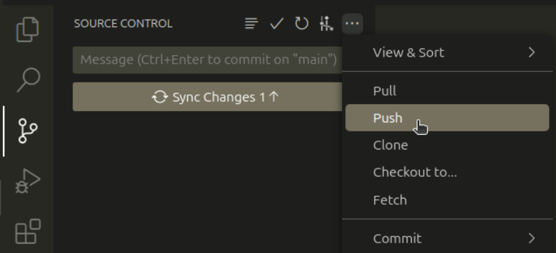

Todos estos pasos pueden realizarse desde la consola de comandos en lugar de la GUI de VSCode, siéntanse libres de utilizar el método que les resulte más cómodo.

Procuren siempre realizar un `pull` del repositorio antes de sentarse a trabajar, de ese modo **el repositorio local se actualizará con las modificaciones que haya en el remoto**. De todos modos, si alguien más realizó un push al repositorio remoto luego de la última vez que hicieron pull, es posible que aparezcan conflictos entre los cambios remotos y sus cambios locales. En la próxima sección dejamos algunas referencias de material complementario para que puedan profundizar cuando lo necesiten.

<h2 id="ref">Referencias</h3>

- [El tutorial de atlassian, que es excelente](https://www.atlassian.com/es/git/tutorials)
- [EL libro](https://git-scm.com/book/es/v2)
- [git guide](http://rogerdudler.github.io/git-guide/)
- [Demo interactiva](https://learngitbranching.js.org/)
- [Otra demo interactiva](https://onlywei.github.io/explain-git-with-d3/)

## Ejercicio 1: Crear una branch

### Branches (ramas)
En GitHub contamos con **branches (ramas)**, que son una versión paralela del repositorio, para tener separado el trabajo que no está listo para incluir en el proyecto finalizado (ya sea porque esta en construcción o porque estamos haciendo experimentos que no queremos queden reflejados).
En general, se intenta que el trabajo presente en la rama principal `main` sea código funcional, y que cada _feature_ que vamos encarando (o bug que vamos a arreglar) lo trabajemos en una branch que no será ''aplicada'' a main hasta que el feature no esté en un estado funcional.
De esta manera, evitamos afectar el proyecto principal con desarrollos a medio terminar.

En la materia trabajaremos en una (o más!) branches, y para entregar les pediremos que hagan un Pull Request + Merge a la branch `main`. 

Para aprender más sobre branches, pueden leer ["Acerca de las Ramas (branches)"](https://docs.github.com/es/pull-requests/collaborating-with-pull-requests/proposing-changes-to-your-work-with-pull-requests/about-branches) en la documentación oficial de Github.

### Ejercicio
Comencemos creando una branch. Esto se puede hacer tanto desde el repositorio local con el comando `git checkout -b my-first-branch`, que creara una branch llamada "my-first-branch", como desde la interfaz web del siguiente modo:

1. Pararse en la pestaña inicial **<> Code**

    

2. Elegir **main** en el drop-down, colocar el nombre de la nueva branch (en la foto, `my-first-branch`) y presionar el botón para crear la nueva branch.
 
    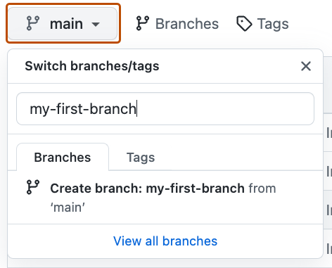

## Ejercicio 2: Modificar un archivo y crear un commit

Ahora introduciremos una modificación en nuestra branch y crearemos un commit con los nuevos cambios.
Un **commit** es un conjunto de cambios a archivos y carpetas en el proyecto, que vive en una branch. Pueden ver más información en ["Acerca de las confirmaciones (commits)"](https://docs.github.com/en/pull-requests/committing-changes-to-your-project/creating-and-editing-commits/about-commits) en la documentación de Github.

Si no lo hicieron aún, este es el momento de [clonar el repositorio](#clonando-el-repositorio) localmente.

Una vez clonado el repositorio, ejecuten el comando `git switch my-first-branch` (reemplazando por el nombre que hayan usado para su branch) para pararse en la versión del repositorio correspondiente a la nueva branch.

Pueden verificar encontrarse en la branch correcta ejecutando el comando `git branch`. Debería mostrar algo como lo siguiente:
```sh
$ git branch
main
* tpGit
```
> [!WARNING]
> Si al hacer `git branch` o al hacer el `git switch` no les aparece el nombre de su branch nueva, es posible que tengan que correr el comando `git pull` para sincronizar su repositorio local con el repositorio remoto. Esto ocurre si clonamos el repositorio antes de crear la branch, y creamos la branch en la interfaz web - necesitamos sincronizar repositorios remoto y local.

Cuando ya esten parados en la branch nueva, vayan a la carpeta donde está nuestro repositorio y completen el archivo `presentacion.md` con su nombre y un poco de información sobre ustedes. No se olviden de guardar!

> [!NOTE] 
> Los archivos .md contienen markdown de Github. Esto es lo que nos permite mostrar imágenes y formato bello en la interfaz web de github. Siéntanse libres de experimentar con Markdown en su archivo de presentación! Pueden encontrar [la documentación aquí](https://docs.github.com/es/get-started/writing-on-github/getting-started-with-writing-and-formatting-on-github/basic-writing-and-formatting-syntax).

Hechos los cambios pertinentes, debemos realizar un commit para versionar los cambios.
Para ello:
1. Añadimos los archivos con cambios a versionar al commit con el comando `git add presentacion.md` (también podemos usar `git add .` para agregar todos los archivos con cambios en la carpeta actual, identificada por `.`, al commit) 
2. Fijamos el commit con el comando `git commit -m "Completo presentacion.md"`. Se puede usar otros mensajes completando una frase distinta (entre comillas) luego de la flag `-m`.
3. Finalmente, **subimos el cambio al repositorio remoto** con el comando `git push`.

Si ahora ingresan a la página web de su repositorio, y navegan a la branch nueva (mismo panel donde crearon la branch anteriormente) deberíán poder ver su nuevo commit.


## Ejercicio 3: crear un Pull Request con los cambios y mergear a main
### Pull requests

Al trabajar con branches, utilizamos Pull Requests para informar al resto de los usuarios del repositorio de los cambios que queremos realizar, y pedir sus comentarios sobre los cambios hechos.
En una pull request se pueden charlar los cambios y discutir posibles mejoras con otros colaboradores.
También se puede continuar agregando cambios a la branch asociada al Pull Request, y estos quedarán registrados en él.

Creemos un Pull Request para nuestra nueva branch.
Esto se realiza desde la interfaz web de github.
Vamos a la pestaña **Pull requests** y presionemos el botón **New pull request** (si les aparece un cartel indicando que su branch tuvo cambios recientemente, pueden utilizar el botón de dicho banner también!)

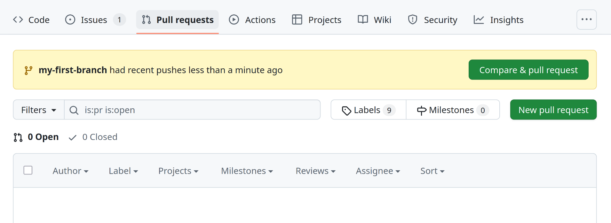

Vamos a seleccionar como base (el lugar a donde queremos enviar los cambios) `main`, y como punto de comparación (el lugar donde están los nuevos cambios) `my-first-branch`.


Una vez que revisemos los cambios introducidos por la nueva branch y veamos todo en orden, podemos presionar `Create pull request`.

Ahora nombramos nuestra Pull Request `Entrega TP Git` y añadimos una descripción pertinente (no hay ningún requisito particular para este TP).

Las Pull Request permiten agregar personas específicas como _reviewers_, para mostrar que queremos su feedback específico.
Procederemos a crear una pull request para nuestra branch y agregar como reviewer a uno de los docentes de la materia.

Para saber qué docente está asignado como reviewer a su TP, contamos con el siguiente sistema de avanzada:

Si el último número de su Libreta Universitaria (el número a la izquierda del `/`) termina en:
1. Asignar a @afernandezortuzar como reviewer
2. Asignar a @brunocompu
3. @franciscod
4. @gasparzuker
5. @jorgecszabo
6. @makobot-sh
7. @npache
8. @pugliesee
9. @stefmr
10. (Si el número termina en 0) @TomasDeLosSantos

(Sí, algunos docentes zafaron de la corrección del TP en esta ocasión :laughing:)

Hecho todo esto, podemos **Crear la Pull Request** con el botón verde que se encuentra debajo de la caja de descripción.

Para leer más sobre Pull Requests, pueden consultar ["Acerca de las solicitudes de incorporación de cambios (Pull Requests)".](https://docs.github.com/es/pull-requests/collaborating-with-pull-requests/proposing-changes-to-your-work-with-pull-requests/about-pull-requests) en la documentación de Github.

## Como hacer consultas de TP

Durante la cursada, manejaremos las consultas que sean específicas de un tp y su implementación mediante el canal público de consultas del servidor de discord, junto con el issue tracker de github.

### Foro de consultas en discord

En el servidor de discord contamos con una sección `Foros de consulta` con foros públicos para consultas administrativas no privadas y consultas específicas de C, asm-x86, simd y system-programming.
Para consultas administrativas de carácter privado pueden contactarnos a `orga-doc@dc.uba.ar`.

Los foros de consultas están pensados para consultas **puntuales**, o que por algún motivo no hayan podido ser respondidas en los laboratorios.
Consultas del tipo "Este ejercicio de la guía no me funciona y no sé por qué" serán derivadas a los espacios de laboratorio dondre tendremos un espacio menos acotado para encararlas.
Sin embargo, para poder destrabarse, pueden enviar al canal de consultas el comportamiento específico que están enfrentando y les daremos recomendaciones de cómo encontrar el problema y encararlo.
De esta manera, el resto de los estudiantes también podrán aprovechar la consulta.

Para realizar una consulta:
1. Seleccionar el foro correspondiente
2. **Utilizar el buscador de discord** para revisar si no se respondieron ya preguntas similares
3. Crear una nueva publicación con un título descriptivo (de ser relevante incluir número de guía o TP y ejercicio)
4. Describir la consulta, teniendo cuidado de no dar soluciones a los trabajos prácticos ya que el canal es público
    - Si la consulta requiere como contexto parte de la implementación de un ejercicio del TP, incluir los detalles privados en un link a la linea de código de github o un link a una **issue de github** (detalles más abajo). 

### Issue tracker en github

Para asistir con el uso del issue tracker de git, contamos con templates predefinidos que nos van a ayudar a organizarnos y les darán una guía de qué información necesitan los docentes para responder su consulta lo más rápido posible.
Incluso es posible que resuelvan algunas dudas por su cuenta en el proceso de completar el template.

Para crear una issue en su repositorio de github:

1. **En su propio fork** del repositorio del TP navegar a la sección `Issues`
2. Presionar el botón `New issue`

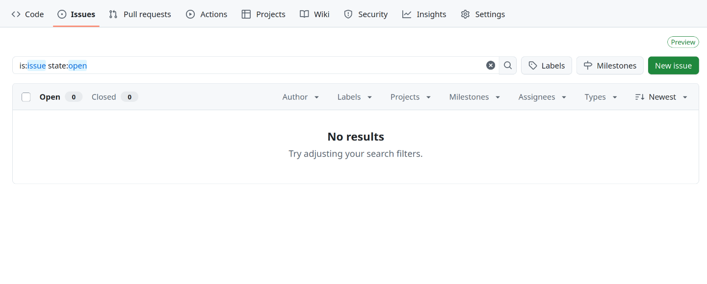

1. En el popup elegir un tipo de issue template
2. En el campo `description` **elegir el template correspondiente** al tipo de consulta a realizar
   > Completar los campos marcados con `[COMPLETAR]`

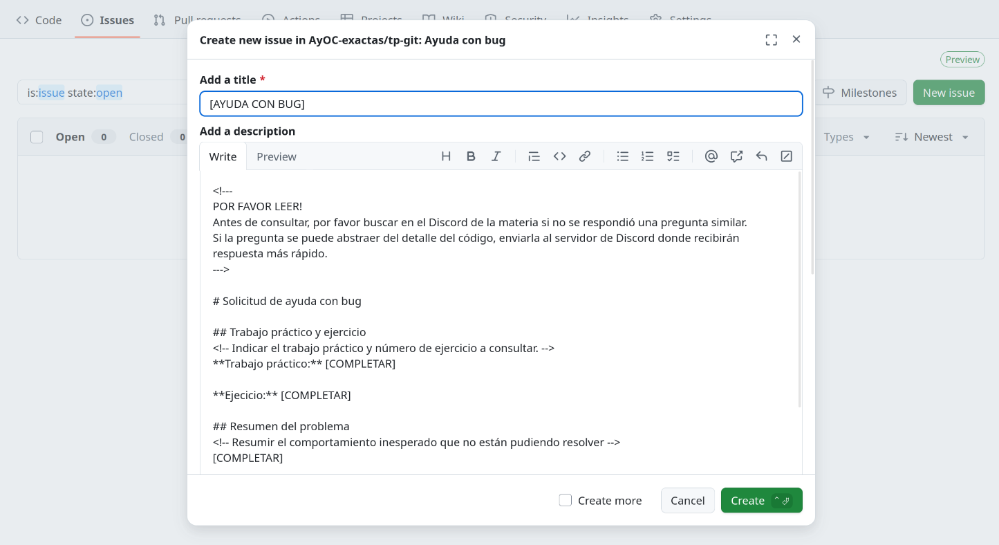

1. Una vez completado el template utilizar el botón `Preview` para revisar que la consulta se esté generando correctamente.
2. Presionar botón `Create`

## Gists

Para evitar pegar enormes logs de debuggeo en la issue, que dificultarían su lectura, vamos a compartir los logs como archivos separados mediante *gists* de Gitlab.
Un _gist_ funciona como un pequeño repositorio con funcionalidad mínima para pocos archivos sueltos, con _syntax highlighting_.
Está pensado para compartir código rápidamente sin necesidad de crear un repositorio completo nuevo.

Para compartir logs o código mediante gists:
1. Presionar el botón `+` al costado de la barra de búsqueda superior
2. Seleccionar la opción `new gist`
    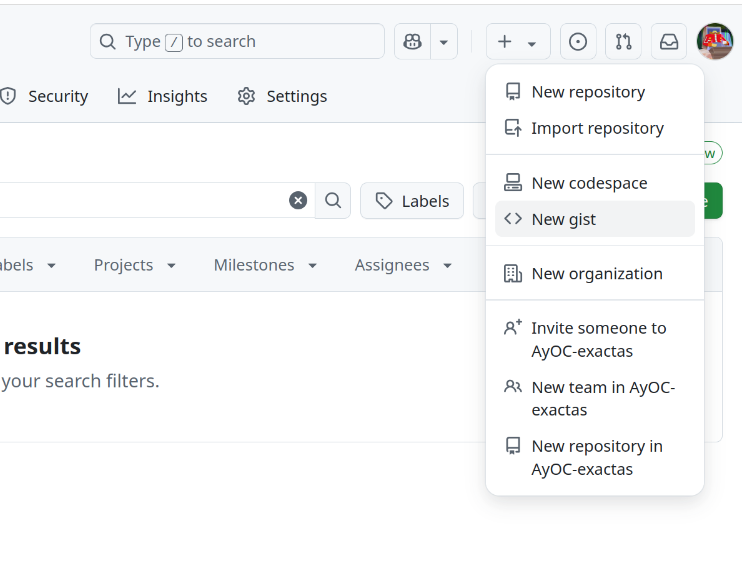
3. Completar título y contenido del gist, presionando el botón `Add another file` si queremos agregar más de un archivo.
    
4. Elegir `Create secret gist` para que el gist no sea público, pero pueda ser accedido por aquellos que tengan el link.
5. Presionar el botón `Create gist`
    

## Ejercicio 4 (opcional): ejercitar issues y gists
Como ejercicio opcional, les proponemos que creen una issue en su repositorio con alguno de los templates provistos por la cátedra (no es necesario que lo completen con información real).
Verán que al usar un issue template, automáticamente se le asigna a todos los docentes de la cátedra!

Incluyan en la issue (pueden modificarla después de su creación) el link a un gist con algo de texto.

